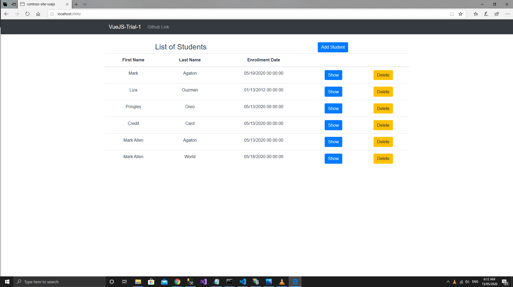
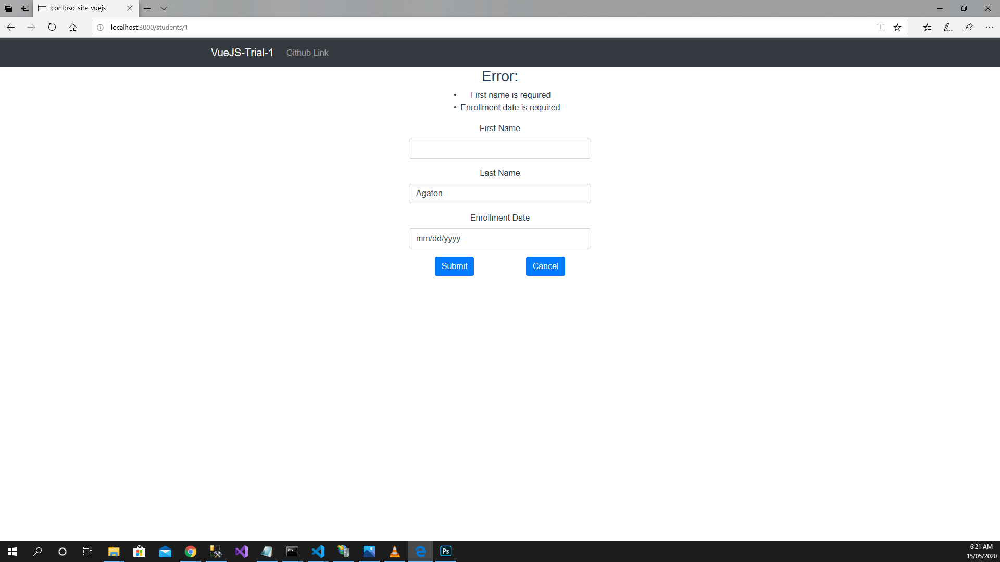
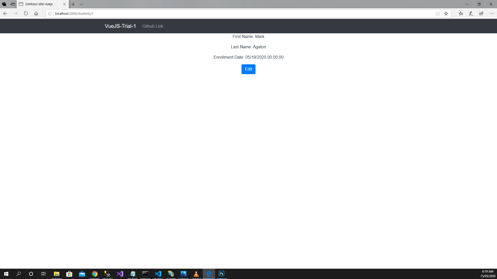

# ASP.NET-MVC-Trial-4

RESTful CRUD using ASP.NET MVC and VueJS as Frontend

## Notes on **_No 'Access-Control-Allow-Origin' header is present on the requested resource_**

- Had this issue when fetching data from the API routes of ASP.NET MVC. I tried to resolve it by adding this XML code in web.config which adds some HTTP headers in the REST API server's response. For more information, see this [link](https://stackoverflow.com/questions/27504256/mvc-web-api-no-access-control-allow-origin-header-is-present-on-the-requested)

```XML
<system.webServer>
  <httpProtocol>
    <customHeaders>
      <add name="Access-Control-Allow-Origin" value="*" />
      <add name="Access-Control-Allow-Headers" value="Content-Type" />
      <add name="Access-Control-Allow-Methods" value="GET, POST, PUT, DELETE, OPTIONS" />
    </customHeaders>
  </httpProtocol>
</system.webServer>
```

- The solution above might work but **it should not be done**. The other solution is to configure a **devServer.proxy** in your VueJS application such as the one shown below. This devServer configuration should be placed in **vue.config.js**. For instance, in the configuration shown below, the RESTful API ASP.NET MVC server runs at **https://localhost:44350** while the VueJS application runs at **http://localhost:3000**. Now, when trying to fetch from the RESTful APIs using either fetch() / \$.ajax() / axios() in javascript, you should set the baseURL of the request to the baseURL of the VueJS application which in this case is at http://localhost:3000. With this setup, we can now prevent having a cross-site request which is the one causing the **No Access-Control-Allow-Origin header is present on the requested resource** error.

- vue.config.js

```javascript
module.exports = {
  devServer: {
    port: 3000,
    proxy: "https://localhost:44350",
  },
};
```

- notice the baseURL when fetching RESTful API, it points to the baseURL of the VueJS application. the **devServer.proxy** settings handles
  the forwarding of the request to the real RESTful API service at https://localhost:44350

```javascript
import axios from "axios";

const baseURL = "http://localhost:3000";

const apiClient = axios.create({
  baseURL: `${baseURL}/api`,
  withCredentials: false,
  headers: {
    Accept: "application/json",
    "Content-Type": "application/json",
  },
});

export default apiClient;
```

## Notes for testing

- The ASP.NET MVC RESTful service is deployed on a local IIS at port 8080. Frontend VueJS requests is also possible while ASP.NET MVC App is
  in debug mode (not deployed on local IIS - i.e. running at https://localhost:44350)
- The VueJS runs at port 3000 and fetches data from its own baseURL (http://localhost:3000) to prevent cross-site request or the encountering of the CORS policy error as discussed above. With the devServer.proxy configuration setup, all requests will be forwarded to the server address of the proxy (i.e. https://localhost:44350).

## Todo

- Refactor MVC App as per the suggestions of sir marc
- The current VueJS file structure seems disorganized. There are also lots of repeating HTML which can be made into finer components
- Use **pug** as the view engine for the HTML templates in VueJS to declutter the template code.
- Enhance **Show** page of the student resource
- Learn more about devServer proxy, vue-cli

## Current Progress

- Index page
  
- Edit page
  
- Show page
  
