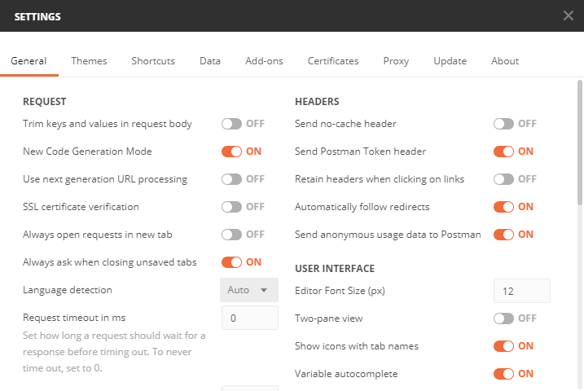

# ASP.NET-MVC-Trial-3
RESTful CRUD App Single Resource

## REST API endpoints
- [GET] /api/students - Index() - Get all students
- [GET] /api/students/:id - Show() - Get a student resource
- [POST] /api/students - Create() - Create a student resource
- [PUT] /api/students/:id - Update() - Update a student resource
- [DELETE] /api/students/:id - Delete() - Delete a student resource

## Notes for HTTP Verbs on ASP.NET MVC 5
- By default, only the **GET** and **POST** HTTP verbs are available in ASP.NET MVC. To use the other HTTP Verbs such as
**PUT** and **DELETE** (i.e. for creating REST API endpoints), you need to edit your **Web.config** file and add the following XML code below. For more information, see this [link](https://weblog.west-wind.com/posts/2015/apr/09/aspnet-mvc-httpverbsdeleteput-routes-not-firing#What%E2%80%99s-the-Problem?)
```xml
  <system.webServer>
    <handlers>
      <remove name="ExtensionlessUrlHandler-Integrated-4.0" />
      <add name="ExtensionlessUrlHandler-Integrated-4.0" path="*."
           verb="GET,HEAD,POST,DEBUG,PUT,DELETE,OPTIONS"
           type="System.Web.Handlers.TransferRequestHandler"
           preCondition="integratedMode,runtimeVersionv4.0" />
    </handlers>
  </system.webServer>
```

## Notes for Local IIS deployment
1. Enable local IIS feature in your Windows machine. This [link](https://www.youtube.com/watch?v=PPaqVyBkwMk) shows how to setup your local IIS on your Windows machine
as well as on how to publish your ASP.NET MVC web application on your local IIS
2. If you are using Entity framework and Microsoft SQL Server, you may encounter problems on database authentication when you're
browsing / fetching your RESTful API routes such as this one:


See the solution in these two links on how to resolve this issue:
- [Link 1](https://stackoverflow.com/questions/7698286/login-failed-for-user-iis-apppool-asp-net-v4-0)
- [Link 2](https://docs.microsoft.com/en-us/previous-versions/sql/sql-server-2008-r2/ms189121(v=sql.105)?redirectedfrom=MSDN)

## Notes for testing REST API endpoints via Postman
- When testing your REST API endpoints using Postman, make sure the **SSL certificate verification** is turned off in 
the settings. See image below.

